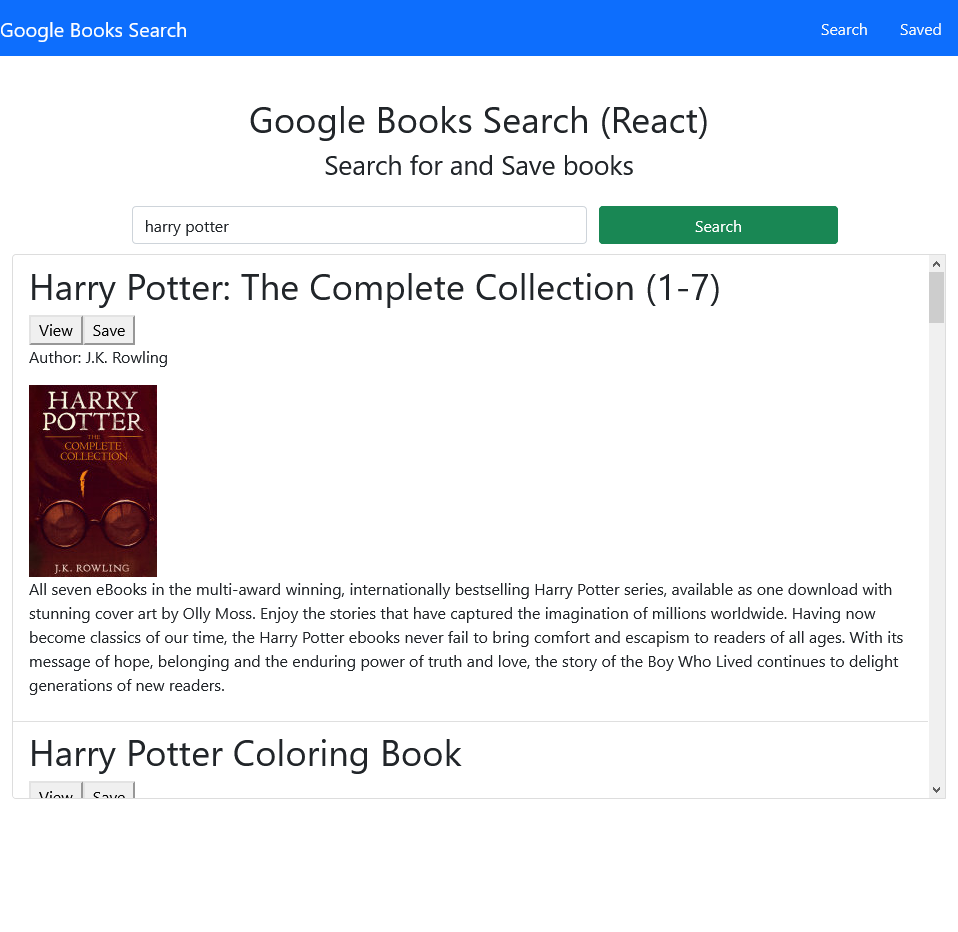
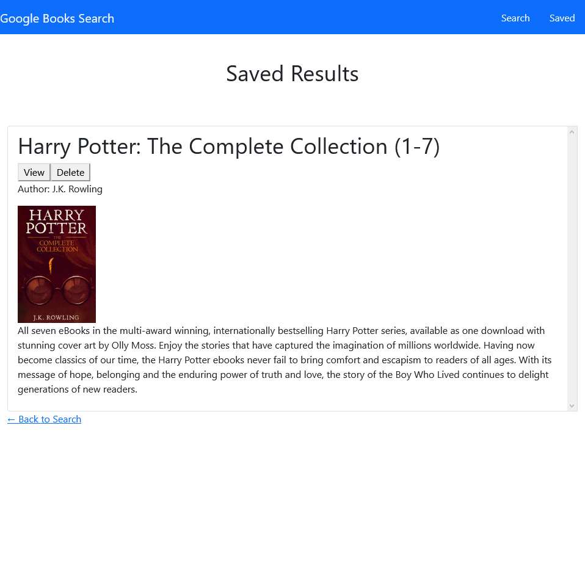
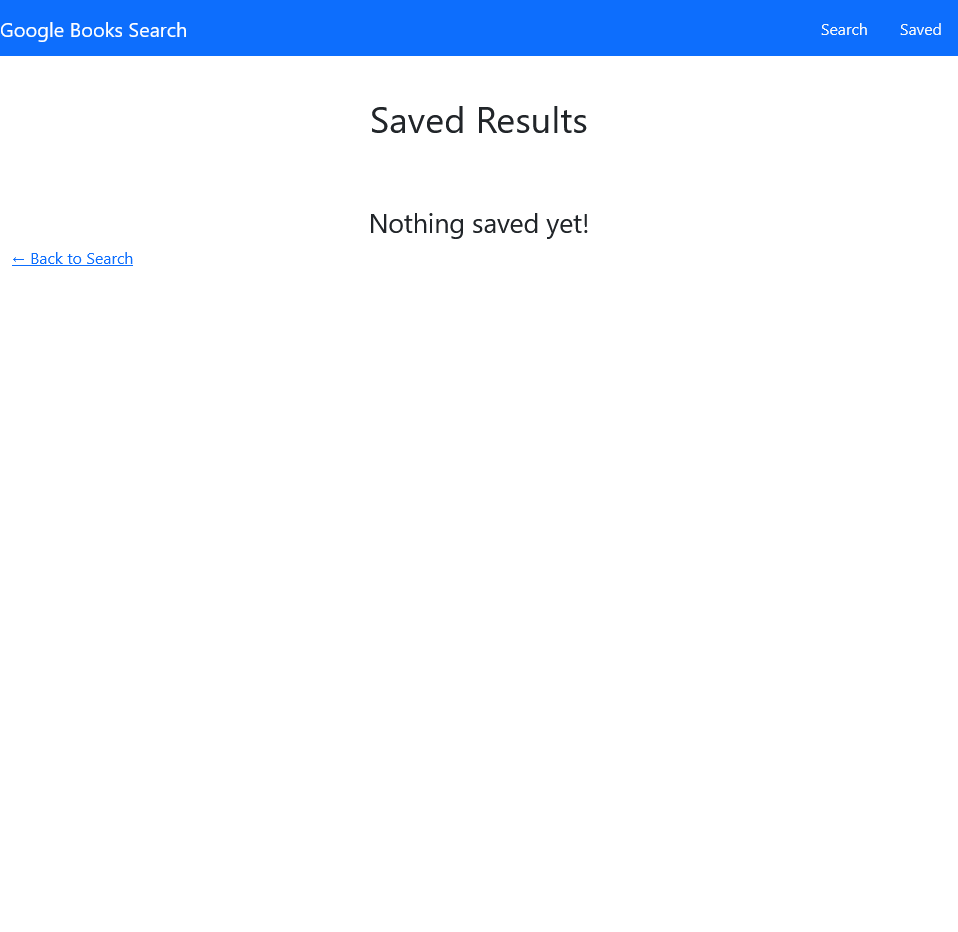

# Book_Search
## Table of Contents
- [Live Link](#Live-Link)
- [Repository Link](#Repository-Link)
- [Code Description](#Code-Description)
- [Installation](#Installation)
- [Function](#Function)
- [Screenshots](#Screenshots)
## Live Link
https://desolate-dawn-13561.herokuapp.com/
## Repository Link
https://github.com/riraq/Book_Search
## Code Description
This application is built using React and the Google Books API and is a MERN stack.
## Installation
1. Clone the repository from https://github.com/riraq/Book_Search.
2. Run "npm i" in the root of the application in order to install dependencies.
## Function
React application using the Google Books API to find books and allow you to save to a list.
## Screenshots
### Homepage with search results populated

### Saved page with a book saved to the list

### An empty page with no saved books to display
